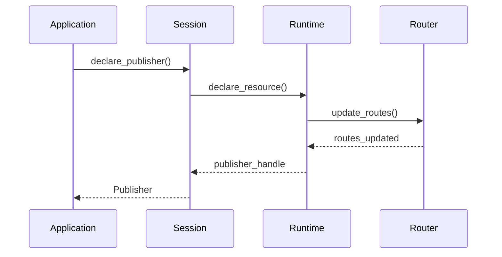
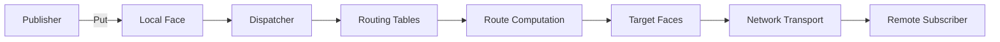

# Zenoh Core Components

This document provides a detailed analysis of Zenoh's core components and their interactions.

## Component Overview

### 1. Session (zenoh/src/api/session.rs)

The Session is the main entry point for applications using Zenoh.

**Key Responsibilities:**
- Manages the lifecycle of publishers, subscribers, queryables, and queries
- Provides high-level API abstractions
- Handles resource declaration and undeclaration
- Manages sample timestamps and QoS settings

**Key Methods:**
- `open()` - Create a new Zenoh session
- `declare_publisher()` - Create a publisher for a key expression
- `declare_subscriber()` - Create a subscriber for a key expression
- `get()` - Perform a query
- `declare_queryable()` - Create a queryable resource

**Internal Structure:**
```rust
pub struct Session {
    pub(crate) id: Id,
    pub(crate) runtime: Arc<Runtime>,
    pub(crate) state: Arc<SessionState>,
    pub(crate) close_state: Arc<Mutex<bool>>,
}
```

### 2. Runtime (zenoh/src/net/runtime/mod.rs)

The Runtime is the core execution engine of Zenoh.

**Key Responsibilities:**
- Manages transport connections
- Coordinates plugin lifecycle
- Maintains the Hybrid Logical Clock (HLC)
- Handles task scheduling through Tokio
- Manages the routing layer

**Components:**
- `TransportManager` - Handles transport connections
- `PluginsManager` - Manages plugin loading and lifecycle
- `Router` - Core routing engine
- `AdminSpace` - Administrative interface

**Initialization Flow:**
1. Parse configuration
2. Initialize transport manager
3. Start router
4. Load plugins
5. Begin accepting connections

### 3. Router (zenoh/src/net/routing/router.rs)

The Router implements the core routing logic.

**Key Responsibilities:**
- Manages faces (connections to other nodes)
- Routes messages between faces
- Maintains routing tables
- Handles resource matching

**Core Concepts:**
- **Face** - Abstraction for a connection (local API or network)
- **Resource** - Internal representation of a key expression
- **Tables** - Central routing state

**Message Flow:**
```
Face A → Dispatcher → Routing Tables → Dispatcher → Face B
```

### 4. Transport Layer (io/zenoh-transport/)

Provides reliable communication between Zenoh nodes.

**Key Components:**
- `TransportUnicast` - Point-to-point connections
- `TransportMulticast` - One-to-many connections
- `TransportManager` - Connection lifecycle management

**Features:**
- Fragmentation and reassembly
- Reliability (configurable)
- Keep-alive mechanism
- Multiple link support per transport

### 5. HAT (Hourglass Architecture Types)

Pluggable routing strategies based on node type.

**Implementations:**
- **Client HAT** - Simple client routing
- **P2P Peer HAT** - Basic peer-to-peer
- **Linkstate Peer HAT** - Full link-state routing
- **Router HAT** - Infrastructure routing

**Interface:**
```rust
pub trait HatTrait {
    fn init(&self, tables: &mut Tables, runtime: &Runtime);
    fn close(&self, tables: &mut Tables);
    fn new_face(&self, tables: &mut Tables, face: &Arc<FaceState>);
    fn close_face(&self, tables: &mut Tables, face: &Arc<FaceState>);
    // ... routing methods
}
```

## Component Interactions

### Session to Runtime Flow



### Message Routing Flow



## Resource Management

Resources in Zenoh form a hierarchical tree structure:

```
/
├── robot/
│   ├── sensor/
│   │   ├── temp
│   │   └── pressure
│   └── cmd/
│       ├── move
│       └── stop
└── monitoring/
    └── stats
```

**Key Features:**
- Wildcard matching (`**`, `*`)
- Efficient prefix-based routing
- Resource contexts for optimization

## Threading Model

Zenoh uses Tokio for async execution:

1. **Main Runtime** - Core async runtime
2. **Transport Threads** - Per-transport I/O handling
3. **Plugin Threads** - Plugin-specific execution
4. **Timer Thread** - Periodic tasks and timeouts

## Memory Management

- **Zero-Copy Buffers** - ZBuf and ZSlice for efficient data handling
- **Arc-based Sharing** - Shared ownership without copying
- **Pooled Allocations** - Reuse of common structures
- **Shared Memory** - Optional SHM support for large data

## Error Handling

Uses `zenoh-result` for consistent error handling:

```rust
pub type ZResult<T> = Result<T, ZError>;

pub struct ZError {
    source: BoxError,
    context: Option<String>,
}
```

## Performance Considerations

1. **Lock-Free Structures** - Where possible
2. **Batch Processing** - Aggregate operations
3. **Lazy Evaluation** - Compute on demand
4. **Route Caching** - Avoid recomputation