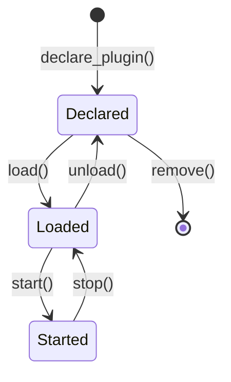

# Zenoh Plugin System

This document describes Zenoh's plugin architecture and how to extend Zenoh functionality through plugins.

## Overview

Zenoh's plugin system provides a flexible mechanism to extend the core functionality without modifying the main codebase. Plugins can be loaded statically (compiled-in) or dynamically (runtime loading).

## Architecture

### Plugin Loading Hierarchy

```
┌─────────────────────────────────────────┐
│         PluginsManager                   │
│  ┌────────────────┬─────────────────┐  │
│  │ Static Plugins │ Dynamic Plugins │  │
│  └────────────────┴─────────────────┘  │
├─────────────────────────────────────────┤
│         Plugin Loader                    │
│  ┌──────────────┬──────────────────┐   │
│  │ Version Check│ Compatibility    │   │
│  │              │ Verification     │   │
│  └──────────────┴──────────────────┘   │
├─────────────────────────────────────────┤
│         Plugin Instances                 │
│  ┌─────────┬──────────┬────────────┐   │
│  │  REST   │ Storage  │  Custom    │   │
│  │  API    │ Manager  │  Plugins   │   │
│  └─────────┴──────────┴────────────┘   │
└─────────────────────────────────────────┘
```

## Plugin Lifecycle

### 1. Plugin States

```rust
pub enum PluginState {
    Declared,  // Plugin is known but not loaded
    Loaded,    // Plugin code is loaded in memory
    Started,   // Plugin is running
}
```

### 2. State Transitions



### 3. Plugin Traits

**Core Plugin Trait:**
```rust
pub trait Plugin: Sized + 'static {
    type StartArgs;
    type Instance: PluginInstance;
    
    const DEFAULT_NAME: &'static str;
    const PLUGIN_VERSION: &'static str;
    const PLUGIN_LONG_VERSION: &'static str;

    fn start(name: &str, args: &Self::StartArgs) 
        -> ZResult<Self::Instance>;
}
```

**Plugin Instance Trait:**
```rust
pub trait PluginInstance: StructVersion + PluginControl + Send {
    fn id(&self) -> &PluginStructVersion;
}

pub trait PluginControl {
    fn status(&self) -> PluginStatus;
    fn plugins(&self) -> Vec<PluginStatusRec>;
}
```

## Plugin Loading Mechanisms

### 1. Static Plugins

Compiled directly into the binary:

```rust
// Declare static plugin
manager.declare_static_plugin::<RestPlugin>();

// Load and start
let loaded = manager.load_plugin("rest").await?;
let started = manager.start_plugin(loaded, args).await?;
```

### 2. Dynamic Plugins

Loaded from shared libraries at runtime:

```rust
// Declare dynamic plugin
manager.declare_dynamic_plugin(
    "my_plugin",
    "/path/to/libmy_plugin.so"
);

// Loading process:
// 1. Load shared library
// 2. Verify plugin loader version
// 3. Check compatibility
// 4. Get plugin VTable
// 5. Create plugin instance
```

### Plugin VTable Structure

```rust
#[repr(C)]
pub struct PluginVTable {
    pub plugin_version: PluginLoaderVersion,
    pub plugin: unsafe extern "C" fn() -> PluginStructVersion,
    pub compatibility: extern "C" fn() -> Compatibility,
    pub start: LoadPluginFn,
}
```

## Zenoh-Specific Plugin Features

### 1. Configuration Updates

Plugins can handle runtime configuration changes:

```rust
pub trait RunningPluginTrait: PluginControl + Send {
    fn config_checker(&self) -> ValidationFunction;
    
    fn update_config(&mut self, config: Config) -> ZResult<()>;
}
```

### 2. Admin Space Integration

Plugins expose status through Zenoh's admin space:

```rust
pub trait RunningPluginTrait {
    fn adminspace_getter<'a>(
        &'a self,
        selector: &'a zenoh::Selector,
        plugin_status_key: &str,
    ) -> ZResult<Vec<zenoh::Reply>>;
}
```

### 3. Plugin Requirements

Plugins can declare requirements:

```rust
pub struct Requirements {
    pub rust_version: Option<RustVersion>,
    pub features: Vec<String>,
    pub metadata: Option<Metadata>,
}
```

## Standard Plugins

### 1. REST API Plugin

Provides HTTP REST interface to Zenoh:
- Query/Reply operations via HTTP
- Pub/Sub through Server-Sent Events
- WebSocket support

### 2. Storage Manager Plugin

Manages persistent storage:
- Volume abstraction for backends
- Query handling for stored data
- Replication support
- Garbage collection

## Creating a Custom Plugin

### Step 1: Define Plugin Structure

```rust
use zenoh_plugin_trait::prelude::*;

pub struct MyPlugin;

impl Plugin for MyPlugin {
    type StartArgs = Config;
    type Instance = MyPluginInstance;
    
    const DEFAULT_NAME: &'static str = "my_plugin";
    const PLUGIN_VERSION: &'static str = env!("CARGO_PKG_VERSION");
    const PLUGIN_LONG_VERSION: &'static str = env!("LONG_VERSION");

    fn start(name: &str, config: &Config) -> ZResult<Self::Instance> {
        // Initialize plugin
        Ok(MyPluginInstance::new(name, config)?)
    }
}
```

### Step 2: Implement Plugin Instance

```rust
pub struct MyPluginInstance {
    name: String,
    runtime: Runtime,
}

impl PluginControl for MyPluginInstance {
    fn status(&self) -> PluginStatus {
        PluginStatus {
            name: self.name.clone(),
            version: MyPlugin::PLUGIN_VERSION.to_string(),
            status: "Running".to_string(),
        }
    }
}

impl RunningPluginTrait for MyPluginInstance {
    fn update_config(&mut self, config: Config) -> ZResult<()> {
        // Handle configuration updates
        Ok(())
    }
}
```

### Step 3: Export Plugin (for Dynamic Loading)

```rust
#[no_mangle]
pub static PLUGIN_LOADER_VERSION: PluginLoaderVersion = 
    zenoh_plugin_trait::PLUGIN_LOADER_VERSION;

zenoh_plugin_trait::declare_plugin!(MyPlugin);
```

## Plugin Best Practices

### 1. Error Handling
- Use `ZResult` for all fallible operations
- Provide meaningful error messages
- Handle cleanup on failure

### 2. Resource Management
- Clean up resources in `drop()`
- Use cancellation tokens for async tasks
- Avoid blocking the runtime

### 3. Configuration
- Validate configuration on load
- Support hot configuration updates
- Provide sensible defaults

### 4. Performance
- Minimize overhead in hot paths
- Use async operations appropriately
- Consider memory usage patterns

## Security Considerations

1. **Plugin Isolation**: Plugins run in the same process (no sandboxing)
2. **Version Checking**: Ensures ABI compatibility
3. **Capability Validation**: Check plugin requirements
4. **Trust Model**: Only load trusted plugins

## Future Directions

1. **Plugin Sandboxing**: WebAssembly-based isolation
2. **Plugin Repository**: Centralized plugin discovery
3. **Hot Reload**: Update plugins without restart
4. **Plugin Dependencies**: Inter-plugin dependencies