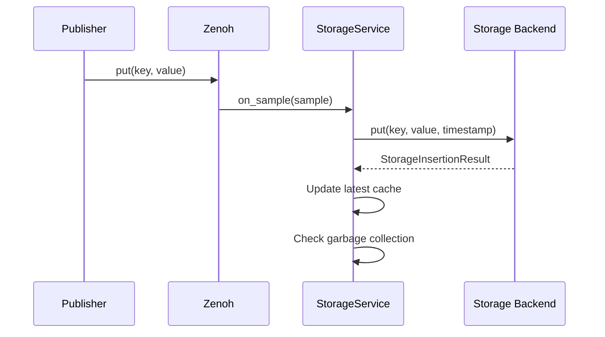
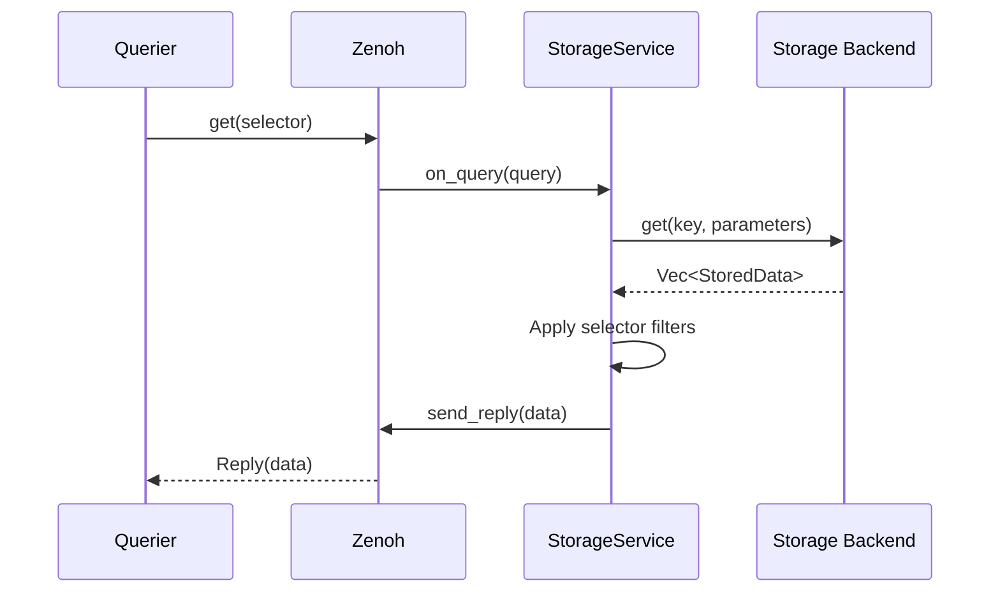

# Zenoh Storage System

This document describes Zenoh's storage architecture, which provides persistence capabilities through a plugin-based system.

## Overview

The storage system in Zenoh is implemented as a plugin (`zenoh-plugin-storage-manager`) that enables data persistence with support for multiple backend implementations. It integrates seamlessly with Zenoh's pub/sub and query/reply mechanisms.

## Architecture

### Storage System Components

```
┌─────────────────────────────────────────────────┐
│          Storage Manager Plugin                  │
├─────────────────────────────────────────────────┤
│         Storage Service Instances                │
│  ┌──────────────┬─────────────┬──────────────┐ │
│  │  Storage 1   │  Storage 2  │  Storage N   │ │
│  │  (Memory)    │  (RocksDB)  │  (Custom)    │ │
│  └──────────────┴─────────────┴──────────────┘ │
├─────────────────────────────────────────────────┤
│             Volume Manager                       │
│  ┌──────────────┬─────────────┬──────────────┐ │
│  │   Memory     │  Filesystem │   Database   │ │
│  │   Backend    │   Backend   │   Backend    │ │
│  └──────────────┴─────────────┴──────────────┘ │
└─────────────────────────────────────────────────┘
```

## Core Concepts

### 1. Volume

A Volume represents a storage backend provider:

```rust
pub trait Volume: Send + Sync {
    fn get_admin_status(&self) -> serde_json::Value;
    
    fn get_capability(&self) -> Capability;
    
    async fn create_storage(
        &self, 
        props: StorageConfig
    ) -> ZResult<Box<dyn Storage>>;
}
```

**Capabilities:**
```rust
pub struct Capability {
    pub persistence: Persistence,  // Volatile or Durable
    pub history: History,         // Latest or All
}
```

### 2. Storage Instance

A Storage instance handles actual data operations:

```rust
pub trait Storage: Send + Sync {
    fn get_admin_status(&self) -> serde_json::Value;
    
    async fn put(
        &mut self,
        key: Option<OwnedKeyExpr>,
        payload: ZBytes,
        encoding: Encoding,
        timestamp: Timestamp,
    ) -> ZResult<StorageInsertionResult>;
    
    async fn delete(
        &mut self,
        key: Option<OwnedKeyExpr>,
        timestamp: Timestamp,
    ) -> ZResult<StorageInsertionResult>;
    
    async fn get(
        &mut self,
        key: Option<OwnedKeyExpr>,
        parameters: &str,
    ) -> ZResult<Vec<StoredData>>;
    
    async fn get_all_entries(&self) 
        -> ZResult<Vec<(Option<OwnedKeyExpr>, Timestamp)>>;
}
```

### 3. Storage Service

The service that manages a storage instance:

```rust
pub struct StorageService {
    session: Arc<Session>,
    config: StorageConfig,
    storage: Box<dyn Storage>,
    capability: Capability,
    
    // Handles for Zenoh operations
    subscriber: Subscriber,
    queryable: Queryable,
    
    // Replication state
    replication: Option<ReplicationService>,
    
    // Garbage collection
    gc_task: Option<ScheduledGc>,
}
```

## Configuration

### Storage Configuration Example

```json
{
  "storages": [
    {
      "key_expr": "demo/memory/**",
      "volume": "memory",
      "strip_prefix": "demo/memory",
      "garbage_collection": {
        "enabled": true,
        "period": 10,
        "depth": 1000
      }
    },
    {
      "key_expr": "demo/rocks/**",
      "volume": {
        "id": "rocks_backend",
        "dir": "/tmp/zenoh-rocks",
        "create_db": true
      },
      "strip_prefix": "demo/rocks",
      "on_closure": "destroy_volume"
    }
  ],
  "volumes": [
    {
      "id": "memory",
      "backend": "memory"
    },
    {
      "id": "rocks_backend",
      "backend": "rocksdb",
      "paths": ["backend_rocksdb"]
    }
  ]
}
```

## Data Flow

### 1. Write Operations (Put/Delete)



### 2. Read Operations (Query)



## Key Features

### 1. Key Expression Management

- **Strip Prefix**: Remove prefix before storing
- **Wildcard Support**: Handle `**` patterns
- **Key Mapping**: Transform keys for backend storage

```rust
// Example: strip_prefix = "demo/memory"
// Input: "demo/memory/sensor/temp"
// Stored as: "sensor/temp"
```

### 2. Timestamp Handling

All operations require timestamps (HLC must be enabled):

```rust
pub struct StoredData {
    pub value: Value,
    pub timestamp: Timestamp,
}
```

### 3. Garbage Collection

For wildcard subscriptions, limit stored entries:

```rust
pub struct GarbageCollectionConfig {
    pub enabled: bool,
    pub period: Duration,  // GC run interval
    pub depth: usize,      // Max entries to keep
}
```

### 4. Replication (Experimental)

For `History::Latest` storages:

```rust
pub struct ReplicationService {
    pub storage_key_expr: OwnedKeyExpr,
    pub replication_log: AlignedRwLock<ReplicationLog>,
}

pub struct ReplicationLog {
    pub subscriberkey: OwnedKeyExpr,
    pub queryable_key: OwnedKeyExpr,
    pub latest_updates: HashMap<OwnedKeyExpr, Event>,
}
```

## Storage Backends

### 1. Memory Backend (Built-in)

Simple in-memory storage:
- Fast access
- No persistence
- Supports only `History::Latest`

### 2. Filesystem Backend (Example)

File-based storage:
- Each key becomes a file
- Directory hierarchy mirrors key structure
- Supports `History::All` with versioned files

### 3. RocksDB Backend (Example)

Key-value database storage:
- High performance
- Persistence
- Compression support
- Configurable options

## Time-Series Considerations

### Current Limitations

The current storage system has limited time-series support:

1. **No Native Time-Range Queries**: Parameters passed but not interpreted
2. **No Aggregations**: Raw data only
3. **No Retention Policies**: Manual or GC-based cleanup
4. **Key-Value Model**: Not optimized for time-series workloads

### Potential Extensions

To add time-series support:

```rust
// Extended Storage trait for time-series
pub trait TimeSeriesStorage: Storage {
    async fn get_range(
        &mut self,
        key: Option<OwnedKeyExpr>,
        start_time: Timestamp,
        end_time: Timestamp,
    ) -> ZResult<Vec<StoredData>>;
    
    async fn aggregate(
        &mut self,
        key: Option<OwnedKeyExpr>,
        start_time: Timestamp,
        end_time: Timestamp,
        aggregation: AggregationType,
    ) -> ZResult<AggregatedData>;
}
```

## Query Handling

### Query Processing Flow

1. **Receive Query**: Queryable receives get request
2. **Generate Candidates**: Find matching keys
3. **Retrieve Data**: Call storage backend
4. **Filter Results**: Apply query constraints
5. **Send Replies**: Return matching data

### Consolidation Modes

Storage respects query consolidation:
- **None**: All stored values returned
- **Monotonic**: Ordered by timestamp
- **Latest**: Only most recent value

## Performance Optimizations

### 1. Latest Value Cache

For `History::Latest` storages:
```rust
latest_updates: HashMap<OwnedKeyExpr, Event>
```

### 2. Batch Processing

Group operations for efficiency:
- Batch writes to backend
- Aggregate GC operations
- Coalesce replication updates

### 3. Async Operations

All storage operations are async:
- Non-blocking I/O
- Concurrent query handling
- Parallel backend operations

## Best Practices

### 1. Backend Selection
- Use memory for temporary data
- Use persistent backends for durable storage
- Consider access patterns when choosing backends

### 2. Key Expression Design
- Use hierarchical structures
- Avoid excessive wildcard depth
- Consider strip_prefix for cleaner storage

### 3. Configuration Tuning
- Set appropriate GC intervals
- Configure reasonable depth limits
- Monitor memory usage for volatile storage

### 4. Error Handling
- Handle backend failures gracefully
- Implement retry logic where appropriate
- Log storage errors for debugging

## Future Enhancements

1. **Native Time-Series Support**
   - Time-range queries
   - Built-in aggregations
   - Retention policies

2. **Advanced Replication**
   - Multi-master replication
   - Conflict resolution
   - Geo-distributed storage

3. **Query Optimization**
   - Index support
   - Query planning
   - Caching strategies

4. **Storage Federation**
   - Cross-storage queries
   - Unified namespace
   - Transparent tiering