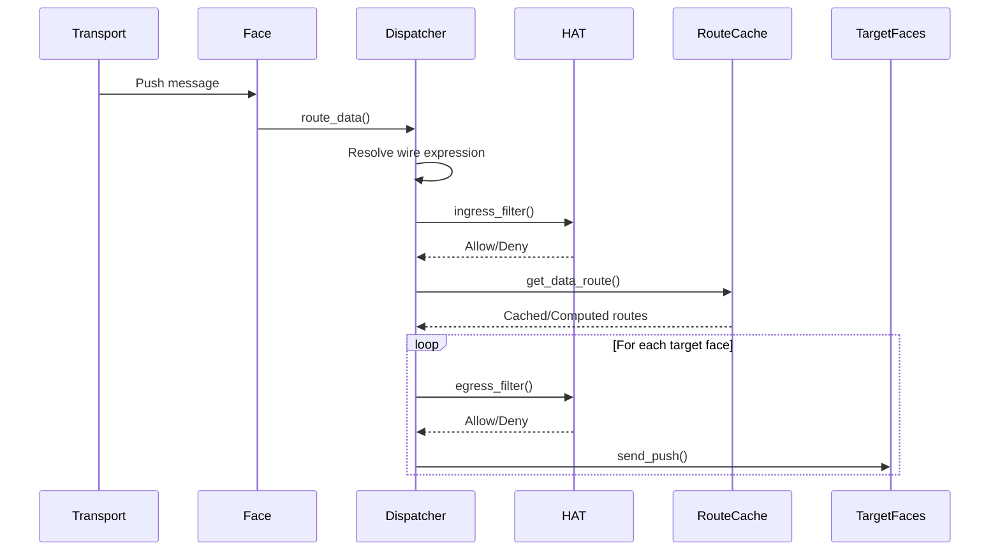
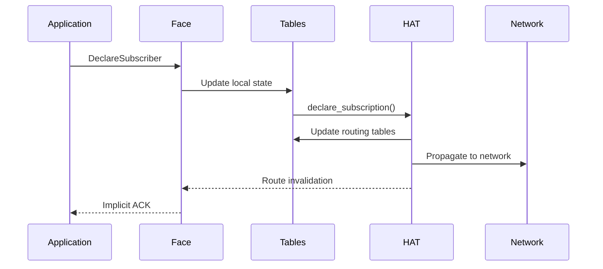
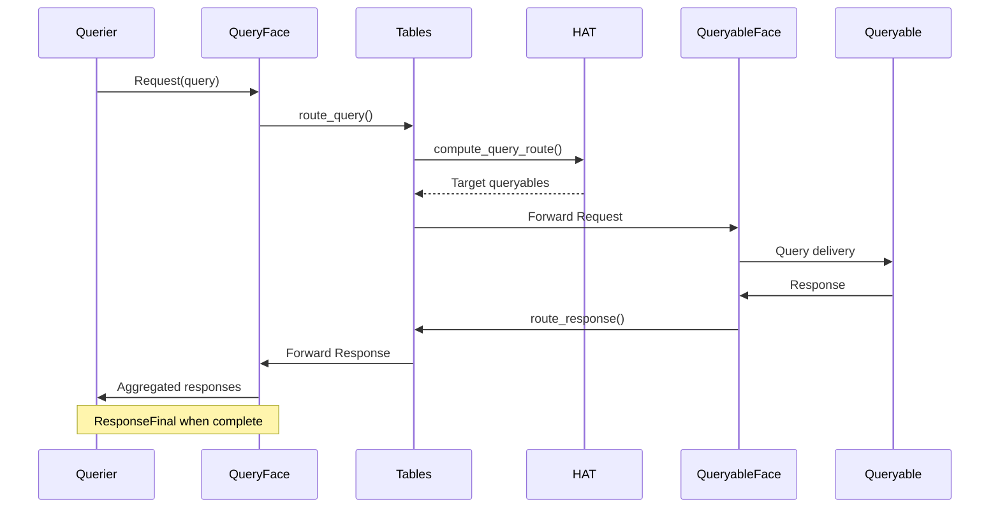

# Zenoh Routing Workflows Study

## Objective

Document the detailed workflows of how messages flow through Zenoh's routing system, covering different message types and routing decisions.

## Methodology

Analysis of message processing workflows in `zenoh/src/net/routing/`, examining:
1. Message reception and initial processing
2. Expression resolution and context creation
3. Route computation and caching
4. Message forwarding and filtering
5. Lifecycle management and state updates

## Executive Summary

Zenoh's routing system processes messages through a sophisticated pipeline that combines expression resolution, route computation, caching, and filtering. The system is designed for high performance with extensive optimizations while maintaining correctness across different routing strategies.

## 1. Core Message Processing Pipeline

### 1.1 High-Level Message Flow

```
Transport Layer → Face → Dispatcher → HAT → Route Cache → Forwarding
     ↓              ↓         ↓        ↓         ↓           ↓
Network Msg → RoutingContext → Expression → Routes → Targets → Send
```

### 1.2 Pipeline Stages

1. **Message Reception**: Transport delivers message to appropriate Face
2. **Context Wrapping**: Message wrapped in RoutingContext with metadata
3. **Expression Resolution**: Wire expressions resolved to full key expressions
4. **HAT Processing**: Routing strategy processes message according to its logic
5. **Route Computation**: Get cached routes or compute new ones
6. **Filtering**: Apply ingress/egress filters based on source and destination
7. **Message Forwarding**: Send to target faces with appropriate transformations

## 2. Data Message Workflow (Put/Delete)

### 2.1 Data Reception Workflow

**Location**: `zenoh/src/net/routing/dispatcher/pubsub.rs`



### 2.2 Detailed Data Routing Process

```rust
pub fn route_data(
    tables_ref: &Arc<TablesLock>,
    face: &FaceState,
    msg: &mut Push,
    reliability: Reliability,
) {
    // Step 1: Expression Resolution
    let tables = tables_ref.tables.read();
    let prefix = tables.get_mapping(face, &msg.wire_expr.scope, msg.wire_expr.mapping)
        .cloned()
        .flatten();
    
    // Step 2: Create Routing Expression
    let mut expr = RoutingExpr::new(&prefix, msg.wire_expr.suffix.as_ref());
    
    // Step 3: Ingress Filtering
    if tables_ref.hat_code.ingress_filter(&tables, face, &mut expr) {
        
        // Step 4: Route Computation
        let route = get_data_route(
            &tables_ref.hat_code,
            &tables,
            face,
            &expr.full_expr,
            &mut expr,
            msg.ext_nodeid.node_id
        );
        
        // Step 5: Message Forwarding
        for (outface, key_expr, context) in route.as_ref() {
            if tables_ref.hat_code.egress_filter(&tables, face, outface, &mut expr) {
                // Transform wire expression for target face
                let wire_expr = Resource::make_wireexpr(outface, key_expr, context);
                
                // Send message
                outface.primitives.send_push(Push {
                    wire_expr,
                    ext_qos: msg.ext_qos,
                    ext_tstamp: msg.ext_tstamp,
                    ext_nodeid: msg.ext_nodeid,
                    payload: msg.payload.clone(),
                });
            }
        }
    }
    drop(tables);
}
```

### 2.3 Wire Expression Resolution

**Expression Mapping Process:**

```rust
pub fn get_mapping(
    &self,
    face: &FaceState,
    scope: &ExprScope,
    mapping: Mapping,
) -> Option<Option<Arc<Resource>>> {
    match (scope, mapping) {
        (ExprScope::RelId, Mapping::Receiver) => {
            // Local mapping - receiver provides expression ID
            face.local_mappings.get(&mapping).cloned()
        }
        (ExprScope::RelId, Mapping::Sender) => {
            // Remote mapping - sender provided expression ID
            face.remote_mappings.get(&mapping).cloned()
        }
        (ExprScope::Global, _) => {
            // Global scope - expression is literal
            Some(None) // No prefix resolution needed
        }
    }
}
```

## 3. Subscription Management Workflow

### 3.1 Subscription Declaration



### 3.2 Subscription Processing Details

```rust
pub fn declare_subscription(
    hat_code: &(dyn HatTrait + Send + Sync),
    tables: &TablesLock,
    face: &mut Arc<FaceState>,
    id: SubscriptionId,
    expr: &WireExpr<'_>,
    sub_info: &SubscriptionInfo,
    node_id: NodeId,
    send_declare: &mut SendDeclare,
) {
    // Step 1: Resolve resource
    let (prefix, suffix) = resolve_resource_mapping(tables, face, expr);
    let res = Resource::get_resource(&tables.tables.read(), &prefix, suffix);
    
    // Step 2: Update local state
    {
        let mut tables = tables.tables.write();
        let res = Resource::make_resource(&mut tables, &prefix, suffix);
        Resource::match_resource(&tables, &res);
        
        // Update face subscriptions
        face.remote_subs.insert(id, (res.clone(), sub_info.clone()));
    }
    
    // Step 3: HAT-specific processing
    hat_code.declare_subscription(
        hat_code,
        tables,
        face,
        id,
        expr,
        sub_info,
        node_id,
        send_declare,
    );
    
    // Step 4: Route invalidation
    tables.tables.write().disable_all_routes();
}
```

## 4. Query Processing Workflow

### 4.1 Query Lifecycle



### 4.2 Query Route Computation

```rust
pub fn route_query(
    tables_ref: &Arc<TablesLock>,
    face: &FaceState,
    qid: RequestId,
    expr: &WireExpr<'_>,
    parameters: &str,
    qbls: &mut RouteMgrs,
) {
    let tables = tables_ref.tables.read();
    
    // Step 1: Expression resolution
    let (prefix, suffix) = resolve_resource_mapping(&tables, face, expr);
    let mut route_expr = RoutingExpr::new(&prefix, suffix);
    
    // Step 2: Find matching queryables
    let query_route = tables_ref.hat_code.compute_query_route(
        &tables,
        &mut route_expr,
        face.whatami,
    );
    
    // Step 3: Forward query to targets
    for (target_face, key_expr, context) in query_route.as_ref() {
        if tables_ref.hat_code.egress_filter(&tables, face, target_face, &mut route_expr) {
            let wire_expr = Resource::make_wireexpr(target_face, key_expr, context);
            let request_id = generate_request_id();
            
            target_face.primitives.send_request(Request {
                id: request_id,
                wire_expr,
                ext_qos: Default::default(),
                ext_tstamp: None,
                ext_nodeid: None,
                ext_target: TargetType::Complete,
                payload: RequestBody::Query(Query {
                    parameters: parameters.into(),
                    ..Default::default()
                }),
            });
            
            qbls.insert(target_face.id, request_id);
        }
    }
}
```

### 4.3 Response Aggregation

```rust
pub fn route_response(
    _tables_ref: &Arc<TablesLock>,
    face: &FaceState,
    qid: RequestId,
    ext_respid: Option<ResponseId>,
    key_expr: WireExpr<'_>,
    body: ResponseBody,
) {
    // Step 1: Find original query context
    if let Some((original_query, _)) = face.pending_queries.get(&qid) {
        
        // Step 2: Forward response to original querier
        original_query.primitives.send_response(Response {
            rid: original_query.qid,
            wire_expr: transform_wire_expr_for_face(&original_query.face, &key_expr),
            payload: body,
            ext_qos: Default::default(),
            ext_tstamp: None,
            ext_respid,
        });
        
        // Step 3: Check if query is complete
        if matches!(body, ResponseBody::Err(_)) || ext_respid.is_none() {
            face.pending_queries.remove(&qid);
            
            // Send final response if all queryables responded
            if face.pending_queries.is_empty() {
                original_query.primitives.send_response_final(ResponseFinal {
                    rid: original_query.qid,
                    ext_qos: Default::default(),
                    ext_tstamp: None,
                });
            }
        }
    }
}
```

## 5. Route Computation and Caching

### 5.1 Route Cache Structure

```rust
pub(crate) struct Routes<T> {
    routers: Vec<Option<T>>,    // Routes for router context
    peers: Vec<Option<T>>,      // Routes for peer context
    clients: Vec<Option<T>>,    // Routes for client context
    version: u64,               // Global version for invalidation
}

pub(crate) struct DataRoutes {
    pub(crate) data_routes: RwLock<Routes<Arc<Route>>>,
}

pub type Route = Vec<(Arc<FaceState>, OwnedKeyExpr, Option<NodeId>)>;
```

### 5.2 Cache Management Workflow

```rust
pub(crate) fn get_or_set_route<T: Clone>(
    routes: &RwLock<Routes<T>>,
    version: RoutesVersion,
    whatami: WhatAmI,
    context: NodeId,
    compute_route: impl FnOnce() -> T,
) -> T {
    // Step 1: Try read-locked cache lookup
    {
        let routes_guard = routes.read();
        if routes_guard.version == version {
            let context_routes = match whatami {
                WhatAmI::Router => &routes_guard.routers,
                WhatAmI::Peer => &routes_guard.peers,
                WhatAmI::Client => &routes_guard.clients,
            };
            
            if let Some(Some(route)) = context_routes.get(context as usize) {
                return route.clone(); // Cache hit
            }
        }
    }
    
    // Step 2: Compute new route (may be expensive)
    let new_route = compute_route();
    
    // Step 3: Write-locked cache update
    {
        let mut routes_guard = routes.write();
        
        // Check if version changed while we were computing
        if routes_guard.version != version {
            routes_guard.version = version;
            routes_guard.routers.clear();
            routes_guard.peers.clear();
            routes_guard.clients.clear();
        }
        
        // Store computed route
        let context_routes = match whatami {
            WhatAmI::Router => &mut routes_guard.routers,
            WhatAmI::Peer => &mut routes_guard.peers,
            WhatAmI::Client => &mut routes_guard.clients,
        };
        
        if context_routes.len() <= context as usize {
            context_routes.resize(context as usize + 1, None);
        }
        context_routes[context as usize] = Some(new_route.clone());
    }
    
    new_route
}
```

### 5.3 Route Invalidation Triggers

**Global Route Invalidation:**
```rust
pub(crate) fn disable_all_routes(&mut self) {
    self.routes_version = self.routes_version.saturating_add(1);
    // All cached routes become invalid due to version mismatch
}
```

**Triggers for route invalidation:**
- Face connection/disconnection
- New subscription/queryable declaration
- Subscription/queryable removal
- Network topology changes
- Configuration updates
- Interest declarations

## 6. Face Lifecycle Management

### 6.1 Face Creation Workflow

```rust
pub fn new_transport_unicast(&self, transport: TransportUnicast) -> ZResult<Arc<DeMux>> {
    // Step 1: Create face state
    let mut tables = self.tables.tables.write();
    let fid = tables.face_counter;
    tables.face_counter += 1;
    
    // Step 2: Initialize HAT-specific state
    let hat_face = self.tables.hat_code.new_face();
    
    // Step 3: Create face wrapper
    let newface = Arc::new(FaceState {
        id: fid,
        zid: transport.get_zid(),
        whatami: transport.get_whatami(),
        primitives: primitives.clone(),
        hat: hat_face,
        // ... other fields
    });
    
    // Step 4: Register face in tables
    tables.faces.insert(fid, newface.clone());
    
    // Step 5: HAT-specific initialization
    let mut declares = Vec::new();
    self.tables.hat_code.new_transport_unicast_face(
        &mut tables,
        &self.tables,
        &mut face,
        &transport,
        &mut |p, m| declares.push((p.clone(), m))
    );
    
    drop(tables);
    
    // Step 6: Send initial declarations
    for (primitives, msg) in declares {
        msg.with_mut(|m| primitives.send_declare(m));
    }
    
    Ok(demux)
}
```

### 6.2 Face Closure Workflow

```rust
fn send_close(&self) {
    // Step 1: Terminate background tasks
    let mut state = zwrite!(self.state);
    state.task_controller.terminate_all(Duration::from_secs(10));
    
    // Step 2: Finalize pending queries
    finalize_pending_queries(&self.tables, &mut state);
    
    // Step 3: Finalize pending interests
    let mut declares = Vec::new();
    finalize_pending_interests(
        &self.tables,
        &mut state,
        &mut |p, m| declares.push((p.clone(), m))
    );
    
    // Step 4: HAT-specific cleanup
    self.tables.hat_code.close_face(
        &self.tables,
        &self.tables.clone(),
        &mut state,
        &mut |p, m| declares.push((p.clone(), m))
    );
    
    // Step 5: Remove from tables
    {
        let mut tables = self.tables.tables.write();
        tables.faces.remove(&state.id);
    }
    
    drop(state);
    
    // Step 6: Send cleanup declarations
    for (primitives, msg) in declares {
        msg.with_mut(|m| primitives.send_declare(m));
    }
}
```

## 7. Interest Propagation System

### 7.1 Interest Declaration Workflow

```rust
pub fn declare_interest(
    tables_ref: &Arc<TablesLock>,
    face: &mut Arc<FaceState>,
    id: InterestId,
    wire_expr: Option<&WireExpr<'_>>,
    interest: Interest,
    send_declare: &mut SendDeclare,
) {
    // Step 1: Register local interest
    {
        let mut tables = tables_ref.tables.write();
        face.local_interests.insert(id, InterestState {
            expr: wire_expr.cloned(),
            mode: interest.mode,
            current: interest.mode != InterestMode::Future,
            finalized: false,
        });
    }
    
    // Step 2: Send current state if requested
    if interest.mode != InterestMode::Future {
        send_current_declarations(tables_ref, face, wire_expr, send_declare);
    }
    
    // Step 3: Propagate interest to network
    tables_ref.hat_code.declare_interest(
        tables_ref,
        face,
        id,
        wire_expr,
        &interest,
        send_declare,
    );
    
    // Step 4: Send final marker
    send_declare.push((face.primitives.clone(), DeclareBody::DeclareFinal(DeclareFinal { id })));
}
```

### 7.2 Current State Delivery

```rust
fn send_current_declarations(
    tables_ref: &Arc<TablesLock>,
    face: &Arc<FaceState>,
    wire_expr: Option<&WireExpr<'_>>,
    send_declare: &mut SendDeclare,
) {
    let tables = tables_ref.tables.read();
    
    // Send matching subscriptions
    for (res, contexts) in &tables.router_subs {
        if wire_expr.map_or(true, |we| resource_matches(res, we)) {
            for (zid, sub_id) in contexts {
                send_declare.push((
                    face.primitives.clone(),
                    DeclareBody::DeclareSubscriber(DeclareSubscriber {
                        id: *sub_id,
                        wire_expr: res.wire_expr(),
                        ext_info: SubscriberInfo::default(),
                    }),
                ));
            }
        }
    }
    
    // Send matching queryables
    for (res, contexts) in &tables.router_qabls {
        if wire_expr.map_or(true, |we| resource_matches(res, we)) {
            for (zid, qabl_id) in contexts {
                send_declare.push((
                    face.primitives.clone(),
                    DeclareBody::DeclareQueryable(DeclareQueryable {
                        id: *qabl_id,
                        wire_expr: res.wire_expr(),
                        ext_info: QueryableInfoType::default(),
                    }),
                ));
            }
        }
    }
}
```

## 8. Error Handling and Edge Cases

### 8.1 Expression Resolution Failures

```rust
// Handle unknown scope in wire expression
match tables.get_mapping(face, &wire_expr.scope, wire_expr.mapping) {
    Some(prefix) => {
        // Normal processing
    }
    None => {
        tracing::error!(
            "{} Route data with unknown scope {}!",
            face,
            wire_expr.scope
        );
        return; // Drop message
    }
}
```

### 8.2 Query Timeout Handling

```rust
fn handle_query_timeout(face: &mut FaceState, qid: RequestId) {
    if let Some((query, _)) = face.pending_queries.remove(&qid) {
        // Send error response for timeout
        query.primitives.send_response(Response {
            rid: query.qid,
            wire_expr: WireExpr::empty(),
            payload: ResponseBody::Err(Value::from("Query timeout")),
            ext_qos: Default::default(),
            ext_tstamp: None,
            ext_respid: None,
        });
        
        // Send final if no more pending queries
        if face.pending_queries.is_empty() {
            query.primitives.send_response_final(ResponseFinal {
                rid: query.qid,
                ext_qos: Default::default(),
                ext_tstamp: None,
            });
        }
    }
}
```

### 8.3 Graceful Degradation

- **Route fallback**: Use direct routes when optimal routes unavailable
- **Partial delivery**: Deliver to available targets when some fail
- **State recovery**: Rebuild routing state after failures
- **Backpressure**: Handle flow control and congestion

## 9. Performance Optimizations

### 9.1 Message Batching

```rust
// Batch multiple declarations in single message
pub struct SendDeclare(Vec<(Arc<dyn EPrimitives + Send + Sync>, DeclareBody)>);

impl SendDeclare {
    pub fn send_all(self) {
        // Group by face and send batched
        let mut batches: HashMap<usize, Vec<DeclareBody>> = HashMap::new();
        
        for (primitives, body) in self.0 {
            let face_id = primitives.face_id();
            batches.entry(face_id).or_default().push(body);
        }
        
        for (face_id, bodies) in batches {
            if bodies.len() == 1 {
                primitives.send_declare(bodies.into_iter().next().unwrap());
            } else {
                primitives.send_declare_batch(bodies);
            }
        }
    }
}
```

### 9.2 Expression Caching

```rust
// Cache resolved expressions in RoutingContext
pub(crate) struct RoutingContext<Msg> {
    pub(crate) msg: Msg,
    pub(crate) inface: OnceCell<Face>,
    pub(crate) outface: OnceCell<Face>,
    pub(crate) prefix: OnceCell<Arc<Resource>>,    // Cached prefix resolution
    pub(crate) full_expr: OnceCell<String>,        // Cached full expression
}
```

### 9.3 Lock Optimization

- **Read-heavy operations**: Use RwLock for route cache access
- **Lock-free fast path**: Route cache lookups without locks
- **Batch updates**: Group multiple table updates under single lock
- **Fine-grained locking**: Separate locks for different subsystems

## Conclusion

Zenoh's routing workflows demonstrate a sophisticated balance between performance and correctness. The system uses extensive caching, lazy evaluation, and optimized data structures to achieve high performance while maintaining strong consistency guarantees across different routing strategies.