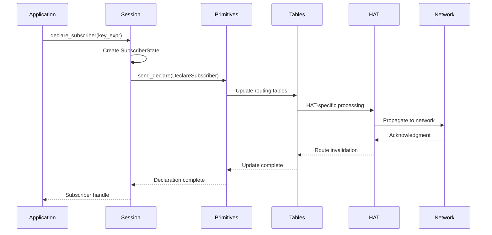
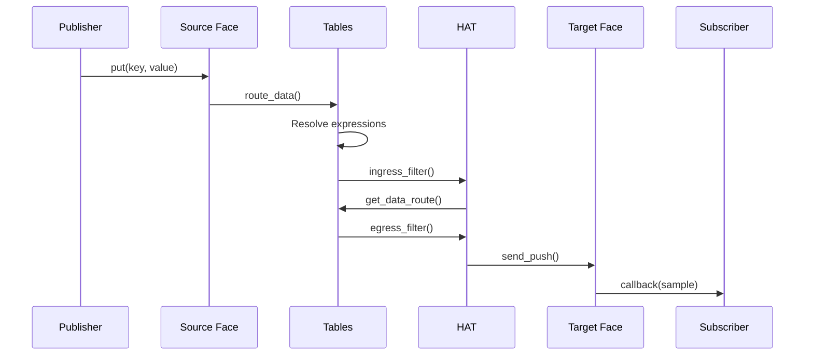
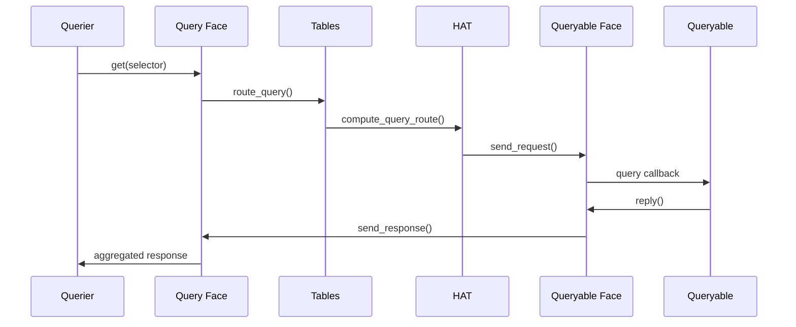
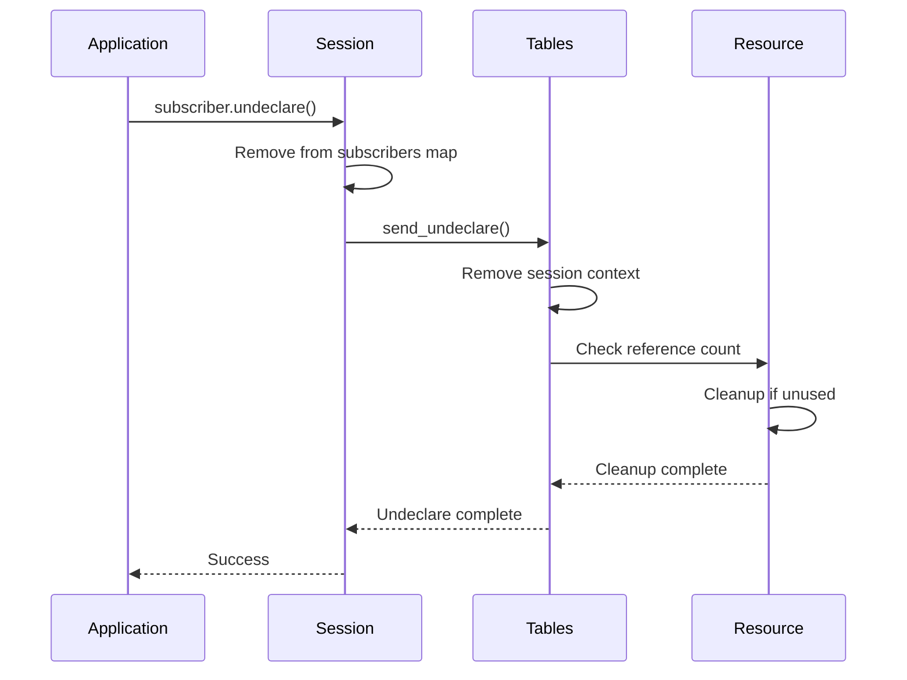

# Zenoh Subscription System: Comprehensive Study

## Objective

Conduct an in-depth analysis of Zenoh's subscription system, examining its architecture, implementation, propagation mechanisms, resource management, and operational workflows.

## Methodology

Comprehensive code analysis covering:
1. Core subscription architecture and data structures
2. Network propagation mechanisms across different HAT implementations
3. Resource tree management and subscription state maintenance
4. Detailed workflow analysis from API to network delivery
5. Performance characteristics and optimization strategies

## Executive Summary

Zenoh's subscription system implements a sophisticated hierarchical pub/sub architecture that unifies data in motion, data at rest, and computations. The system is built around a pluggable routing architecture (HAT) that adapts to different network topologies while maintaining consistent semantics and high performance through advanced caching, lazy evaluation, and zero-copy optimizations.

## 1. Subscription Architecture Overview

### 1.1 Core Design Principles

**Hierarchical Organization**: Key expressions organized in tree structure for efficient matching
**Pluggable Routing**: HAT (Hierarchical Architecture Types) enable topology-specific optimizations
**Zero-Copy Performance**: Minimal data copying through sophisticated buffer management
**Interest-Driven Propagation**: Subscriptions propagated only where needed
**Multi-Level Caching**: Network, resource, and route-level caching for performance

### 1.2 System Architecture

```
Application Layer
├── Session API (declare_subscriber, put, get)
├── Builder Pattern (SubscriberBuilder, QueryableBuilder)
└── Callback Management (Arc<SubscriberState>)

Routing Layer  
├── HAT Implementations (Router, Peer, Client)
├── Resource Tree Management
├── Route Computation and Caching
└── Interest Propagation

Network Layer
├── Face Management (Connection abstraction)
├── Transport Integration (TCP, UDP, QUIC, etc.)
├── Expression Mapping (Wire protocol optimization)
└── Message Serialization
```

### 1.3 Key Data Structures

#### Session State
```rust
pub struct SessionState {
    pub(crate) primitives: Option<Arc<dyn Primitives + Send + Sync>>,
    pub(crate) subscribers: HashMap<Id, Arc<SubscriberState>>,
    pub(crate) queryables: HashMap<Id, Arc<QueryableState>>,
    // ... additional fields
}
```

#### Resource Tree Node
```rust
pub struct Resource {
    pub(crate) parent: Option<Arc<Resource>>,
    pub(crate) expr: String,
    pub(crate) suffix: usize,
    pub(crate) children: SingleOrBoxHashSet<Child>,
    pub(crate) context: Option<Box<ResourceContext>>,
    pub(crate) session_ctxs: HashMap<usize, Arc<SessionContext>>,
}
```

#### Routing Tables
```rust
pub struct Tables {
    pub(crate) zid: ZenohIdProto,
    pub(crate) whatami: WhatAmI,
    pub(crate) root_res: Arc<Resource>,
    pub(crate) faces: HashMap<usize, Arc<FaceState>>,
    pub(crate) hat: Box<dyn Any + Send + Sync>,
    pub(crate) routes_version: RoutesVersion,
}
```

## 2. Subscription Propagation Mechanisms

### 2.1 HAT-Specific Propagation Strategies

#### Router HAT: Hierarchical Routing
**Target Scenario**: Large-scale enterprise and service provider networks
**Key Features**:
- Dual network support (router + peer networks)
- Spanning tree construction for efficient multicast
- Master router election to prevent loops
- Sourced subscription propagation with full attribution
- Automatic peer failover brokering

**Propagation Algorithm**:
```rust
fn propagate_sourced_subscription(
    tables: &Tables,
    res: &Arc<Resource>, 
    source: &ZenohIdProto,
    sub_info: &SubscriberInfo,
    net_type: WhatAmI,
) {
    let net = hat.get_net(net_type);
    send_sourced_subscription_to_net_children(
        tables, net, &net.trees[source_idx].children,
        res, src_face, sub_info, source_idx,
    );
}
```

#### LinkState Peer HAT: Topology-Aware P2P
**Target Scenario**: Medium-scale stable networks requiring optimal paths
**Key Features**:
- Link-state protocol for topology discovery
- SPF (Shortest Path First) tree computation
- Weighted link support for QoS
- Background tree computation workers

**Route Computation**:
- Uses Bellman-Ford algorithm for shortest path calculation
- Maintains complete network topology graph
- Recomputes trees on topology changes with 100ms batching delay

#### P2P Peer HAT: Simple Mesh
**Target Scenario**: Small dynamic networks
**Key Features**:
- Direct peer-to-peer propagation
- Gossip-based discovery
- Minimal state maintenance
- Fast convergence for small networks

#### Client HAT: Edge Forwarding
**Target Scenario**: Resource-constrained edge devices
**Key Features**:
- Minimal overhead routing
- Upstream dependency on routers/peers
- Simple loop prevention
- No topology management

### 2.2 Interest-Driven Discovery

**Interest Types**:
- **Current**: Existing declarations
- **Future**: New declarations  
- **CurrentFuture**: Both existing and new

**Propagation Flow**:
```
Interest Declaration → HAT-specific filtering → Network propagation → Discovery response
```

**Optimization Strategy**:
- Only propagate interests where relevant
- Aggregate multiple interests when possible
- Use timeout-based cleanup for stale interests

## 3. Resource Tree Management

### 3.1 Hierarchical Organization

**Tree Structure**:
```
root_res ("/")
├── robot/
│   ├── sensor/
│   │   ├── temperature
│   │   └── pressure  
│   └── actuator/
│       └── motor/
│           └── speed
└── building/
    └── floor1/
        └── room101/
            ├── temperature
            └── humidity
```

### 3.2 Resource Lifecycle Management

#### Creation Process
1. **Path Decomposition**: Split key expression by `/` separator
2. **Tree Traversal**: Navigate existing structure to find insertion point  
3. **Node Creation**: Create missing intermediate nodes
4. **Context Upgrade**: Add routing context when needed

#### Matching Algorithm
```rust
impl Resource {
    pub fn get_matches(&self, expr: &str) -> Vec<Weak<Resource>> {
        let mut queue = VecDeque::new();
        let mut matches = Vec::new();
        
        queue.push_back(self);
        while let Some(res) = queue.pop_front() {
            if self.intersects_expression(expr) {
                matches.push(Arc::downgrade(res));
            }
            // Add children to queue for wildcards
            if expr.contains("**") {
                queue.extend(res.children.iter());
            }
        }
        matches
    }
}
```

#### Cleanup Strategy
- **Reference Counting**: Automatic cleanup when strong count ≤ 3
- **Cascading Cleanup**: Parent cleanup when all children removed
- **Weak References**: Avoid circular dependencies in match relationships

### 3.3 Subscription State Management

#### Per-Session Context
```rust
pub(crate) struct SessionContext {
    pub(crate) face: Arc<FaceState>,
    pub(crate) local_expr_id: Option<ExprId>,
    pub(crate) remote_expr_id: Option<ExprId>, 
    pub(crate) subs: Option<SubscriberInfo>,
    pub(crate) qabl: Option<QueryableInfoType>,
    pub(crate) token: bool,
}
```

#### Memory Management
- **Arc-based Sharing**: Safe concurrent access across threads
- **Lazy Context Creation**: Routing context created only when needed
- **Efficient Cleanup**: Automatic resource deallocation on last reference

## 4. Subscription Workflows

### 4.1 Declaration Workflow



### 4.2 Data Delivery Workflow



### 4.3 Query/Queryable Workflow



### 4.4 Cleanup Workflow



## 5. Performance Characteristics

### 5.1 Time Complexity

| Operation | Best Case | Average Case | Worst Case |
|-----------|-----------|--------------|------------|
| Subscription Declaration | O(1) | O(log n) | O(n) |
| Expression Matching | O(1) | O(m log n) | O(mn) |
| Route Lookup | O(1) | O(1) | O(n) |
| Resource Cleanup | O(1) | O(log h) | O(h) |

Where:
- n = number of resources
- m = number of wildcards in expression
- h = tree height

### 5.2 Space Complexity

| Component        | Space Usage | Scaling Factor               |
|------------------|-------------|------------------------------|
| Resource Tree    | O(n)        | Number of unique prefixes    |
| Routing Tables   | O(r × c)    | Resources × routing contexts |
| Session State    | O(s)        | Number of subscriptions      |
| Expression Cache | O(e)        | Number of cached expressions |

### 5.3 Optimization Strategies

#### Caching Hierarchy
1. **Expression Cache**: Resolved expressions cached per face
2. **Route Cache**: Computed routes cached with version invalidation
3. **Match Cache**: Resource matches cached for repeated queries

#### Memory Optimizations
- **Prefix Sharing**: Common expression prefixes shared in tree
- **Lazy Allocation**: Context created only when needed
- **Weak References**: Prevent circular dependencies

#### Wire Protocol Optimizations
- **Expression Mapping**: Use numeric IDs instead of full strings
- **Batch Declarations**: Group multiple operations
- **Compression**: Efficient encoding of common patterns

## 6. Thread Safety and Concurrency

### 6.1 Locking Strategy

**Lock Hierarchy (to prevent deadlocks)**:
1. `SessionState` (RwLock) - Coarse-grained session state
2. `TablesLock` - Network routing tables
3. Individual resource locks - Fine-grained access

**Synchronization Patterns**:
- **Reader-Writer Locks**: Allow concurrent reads of session state
- **Arc-based Sharing**: Safe multi-threaded resource access
- **Lock-Free Paths**: Atomic operations where possible
- **Callback Isolation**: Independent callback execution

### 6.2 Memory Safety

**Ownership Patterns**:
- `Arc<T>` for shared ownership
- `Weak<T>` for non-owning references
- RAII for automatic resource cleanup
- Drop implementations for guaranteed cleanup

**Reference Management**:
- Circular reference prevention through weak pointers
- Automatic cleanup when last reference dropped
- Resource leak prevention through Drop traits

## 7. Integration with Transport Layer

### 7.1 Face Abstraction

**Face Types**:
- **Local Faces**: Direct API connections
- **Network Faces**: Remote connections via transport
- **Multicast Faces**: Group communication

**Expression Mapping**:
- Local expressions mapped to numeric IDs for wire efficiency
- Remote expressions tracked per face
- Bidirectional mapping for optimization

### 7.2 Transport Protocol Support

**Supported Transports**:
- TCP: Reliable, ordered delivery
- UDP: Best-effort, low overhead
- QUIC: Modern alternative with built-in encryption
- WebSocket: Browser compatibility
- Shared Memory: Zero-copy local communication

**Protocol Adaptation**:
- Automatic protocol selection based on connectivity
- Transport-specific optimizations
- Seamless failover between transports

## 8. Error Handling and Resilience

### 8.1 Error Categories

**Configuration Errors**:
- Invalid key expressions
- Permission denied
- Conflicting configurations

**Network Errors**:
- Transport failures
- Routing inconsistencies
- Timeout conditions

**Resource Errors**:
- Memory allocation failures
- ID space exhaustion
- Reference leaks

### 8.2 Recovery Mechanisms

**Graceful Degradation**:
- Continue operation with reduced functionality
- Isolate failures to prevent cascade
- Automatic cleanup of failed resources

**State Recovery**:
- Route recomputation on topology changes
- Interest re-propagation after failures
- Session state restoration

## 9. Future Enhancement Opportunities

### 9.1 Performance Improvements

**Algorithmic Enhancements**:
- Incremental tree updates instead of full recomputation
- Better cache replacement policies
- Parallel route computation

**Memory Optimizations**:
- More compact data structures
- Better memory layout for cache efficiency
- Reduced allocation overhead

### 9.2 Feature Extensions

**Enhanced Subscription Semantics**:
- Time-based subscriptions
- Content-based filtering
- Priority-based delivery

**Improved Scalability**:
- Hierarchical subscription aggregation
- Geographic distribution optimizations
- Dynamic load balancing

### 9.3 Monitoring and Observability

**Metrics and Monitoring**:
- Subscription count and distribution
- Route computation time
- Memory usage tracking
- Network propagation latency

**Debugging Support**:
- Route visualization tools
- Subscription trace analysis
- Performance profiling integration

## Conclusion

Zenoh's subscription system represents a sophisticated balance between performance, scalability, and feature richness. The HAT-based architecture successfully decouples routing policy from mechanism, enabling optimal strategies for different deployment scenarios. Key strengths include:

**Technical Excellence**:
- Zero-copy architecture for maximum performance
- Sophisticated caching strategies with version-based invalidation
- Thread-safe design with minimal lock contention
- Automatic resource management with strong safety guarantees

**Architectural Flexibility**:
- Pluggable routing strategies through HAT abstraction
- Support for diverse network topologies
- Seamless integration across transport protocols
- Extensible design for future enhancements

**Operational Robustness**:
- Comprehensive error handling and recovery
- Graceful degradation under adverse conditions
- Automatic cleanup and resource management
- Strong consistency guarantees

The system successfully scales from simple edge device deployments to complex enterprise infrastructures while maintaining consistent semantics and high performance characteristics. This makes it well-suited for the diverse requirements of modern distributed systems, IoT deployments, and real-time applications.
